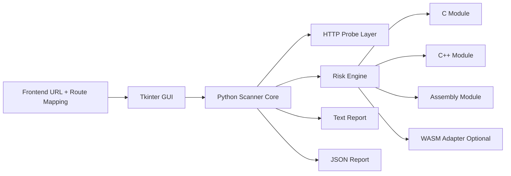

<div align="center">
  <h1>Nervin Defender Console</h1>
  <p><strong>Defensive backend security scanning with a desktop command center</strong></p>
  <p>Map frontend routes to backend endpoints, run hardened checks, and ship safer services.</p>

  <p>
    
    
    
    
  </p>
</div>

---

## Overview

Nervin Defender Console is a security-focused backend scanner for authorized defensive testing.
It gives teams a Tkinter desktop app to map frontend pages to backend API endpoints, then run practical hardening checks with both human-readable and JSON reporting.

## Why Teams Use It

- Clear desktop workflow for security scanning without complex setup
- Route-to-endpoint mapping that mirrors real application traffic surfaces
- Useful default checks for API hardening and exposure risk
- Hybrid performance model using Python orchestration plus native scoring modules
- Multiple run modes: GUI, CLI, and local API service

## Tech Stack

- Python: scanner engine, GUI, orchestration, API mode
- C: endpoint entropy/risk boost scoring
- C++: anomaly signal scoring
- Assembly (x86_64): low-level jitter scoring
- WebAssembly (optional via `wasmtime`): score adjustment runtime

## Architecture



## Feature Set

### GUI Workflow

- Define project name, frontend URL, backend URL, timeout
- Discover frontend routes from `<a href>` links
- Add and maintain page-to-endpoint mapping table
- Save and load project profiles as JSON
- Run scans and read reports directly in-app

### Security Checks

- Backend HTTPS usage warning
- Missing security header detection
- Dangerous HTTP method exposure detection (`TRACE`, `TRACK`)
- Sensitive endpoint exposure hints
- Reflection probe for GET endpoints
- Optional aggressive rate-limit signal checks

### Native + Fallback Execution

- Loads native shared libraries via `ctypes` when available
- Falls back to Python-based scoring when native modules are missing
- Works without optional WASM runtime, with graceful fallback notes in report

## Project Structure

```text
src/defender_app/
  core/       # scanner, models, reporting, project storage
  gui/        # Tkinter desktop app
  native/     # native loader + wasm adapter
  utils/      # HTTP client, URL tools, route discovery
native/
  c/          # C scoring module source
  cpp/        # C++ scoring module source
  asm/        # Assembly module source
  wasm/       # WAT reference
scripts/      # build and run scripts
tests/        # unit tests
docs/         # end-user documentation
```

## Quick Start

### 1. Move into the project

```bash
cd /home/chisomlifeeke/Documents/high--level-backend-softwares-Nervintech-project-0001X10-
```

### 2. Build native modules (recommended)

```bash
./scripts/build_native.sh
```

### 3. Launch the GUI

```bash
./scripts/run_gui.sh
```

## Run Modes

### Premium Web Landing + Login

```bash
cd site
python3 -m http.server 5500
```

Open:

- `http://127.0.0.1:5500/index.html`
- `http://127.0.0.1:5500/login.html`

### GUI Mode

```bash
./scripts/run_gui.sh
```

### CLI Mode (scan from project JSON)

```bash
./scripts/run_cli_scan.sh sample_project.json
```

### API Mode (localhost service)

```bash
./scripts/run_api.sh
```

Then call the local API:

```bash
curl -X POST http://127.0.0.1:8088/scan \
  -H "Content-Type: application/json" \
  --data @sample_project.json
```

## Project Profile Format

A scan profile uses JSON like this:

```json
{
  "project_name": "Production API Shield",
  "frontend_url": "https://example.com",
  "backend_url": "https://api.example.com",
  "endpoints": [
    { "frontend_path": "/", "backend_path": "/health", "method": "GET" },
    { "frontend_path": "/dashboard", "backend_path": "/api/v1/admin", "method": "GET" }
  ],
  "timeout_seconds": 5.0,
  "aggressive_checks": false
}
```

## Optional WebAssembly Runtime

Install optional WASM support:

```bash
python3 -m pip install -r requirements.txt
```

If `wasmtime` is not installed, the scanner continues with Python fallback behavior.

## Testing

Run unit tests:

```bash
PYTHONPATH=src python3 -m unittest discover -s tests -v
```

## Documentation

- Detailed GUI user guide: [docs/GUI_USER_GUIDE.md](docs/GUI_USER_GUIDE.md)

## Security Notice

This tool is for authorized defensive testing only.
Run scans only on systems you own or have explicit permission to assess.
Always validate findings with backend logs, infrastructure controls, and security team review.

## License

MIT License. See [LICENSE](LICENSE).
